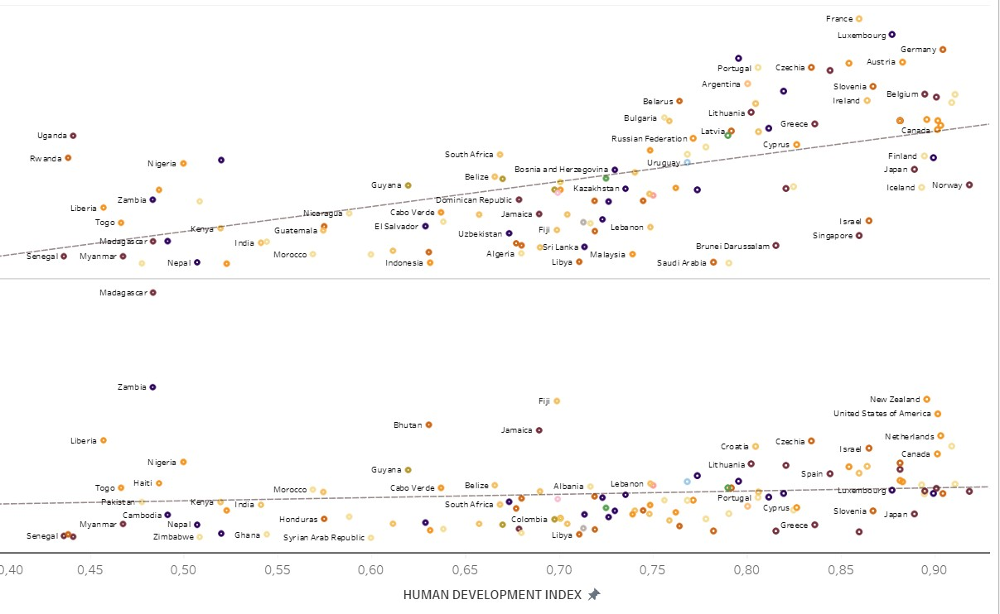

# SUBSTANCE USE AROUND THE WORLD: A Case Study
[For visualization click here](https://public.tableau.com/app/profile/ana6985/viz/AnalisisconsumodrogasyalcoholFinal2/Dash_world?publish=yes)

This repository contains data, code, and visualizations for a case study on substance use around the world. The study focuses on the consumption of alcohol and drugs by continent and country, and its relationship with the Human Development Index (HDI). The data sources used in this study are from the United Nations Office on Drugs and Crime and the World Health Organization (WHO).

## Folder Structure
- Datos/Drogas: Contains the original datasets on drug use.
- Datos/Finales: Contains the cleaned and preprocessed datasets used for visualization.
- Imagenes: Contains images used in Tableau.
- Notebooks: Contains the Jupyter Notebooks used for data cleaning and visualization.

## Libraries Used
- NumPy
- pandas
- pycountry
- matplotlib
- Tableau (for visualization)

## Visualization
The visualization project provides interactive dashboards that present insights on substance use around the world. The visualizations are created with Tableau and are based on data from the United Nations Office on Drugs and Crime and the World Health Organization.

The main dashboard displays the total liters of pure alcohol consumed per capita by continent and sex, as well as the prevalence of stimulant versus depressant drug use. The dashboard reveals that men consume more alcohol than women and that depressant drugs are more commonly used than stimulants.

There is also a world map that shows the average prevalence of drug use by continent, with darker colors indicating higher consumption. In addition, a yellow circle represents alcohol consumption by continent, which grows in size as consumption increases. Hovering over a continent displays a window showing the relationship between consumption and HDI, revealing an upward trend in most countries, except for Oceania and Africa. The dashboard also highlights the case of Haiti, which has a high consumption rate despite its low HDI.

Pressing on a continent takes you to a separate dashboard that shows the alcohol consumption for that continent, separated by percentage of alcohol content, with low being beer and wine, and high being spirits and other beverages. The dashboard also shows the prevalence of stimulant versus depressant drug use, with icons representing each substance and its prevalence percentage.

Clicking on a country opens another dashboard that analyzes the consumption of that country, as well as its mental health indicators such as anxiety, depression, and others.

## Conclussions
Based on the analysis conducted in this case study, it can be concluded that there are significant differences in substance use patterns across different continents and countries. Men tend to consume more alcohol than women, and depressant drugs are more commonly used than stimulants. The relationship between substance use and the Human Development Index (HDI) is complex, with some countries experiencing an upward trend in consumption despite having a low HDI. Mental health indicators such as anxiety and depression also play a role in substance use patterns. Overall, this case study highlights the importance of understanding substance use patterns and their relationship with other social and economic factors.

